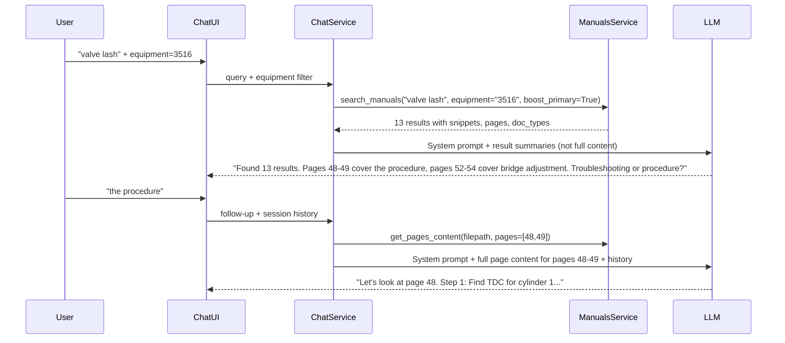

# Search-Integrated Collaborative Chat Assistant

## Problem

The current chat runs its own weaker FTS5 query (`get_context_for_llm()`) that duplicates and diverges from the proven `search_manuals()`. The LLM gets different (worse) results than the search UI, misses equipment filters, and tries to be an oracle instead of a collaborative guide.

## New Architecture




## Changes by File

### 1. New function in [src/services/manuals_service.py](src/services/manuals_service.py)

Add `get_pages_content()` to fetch full page content for specific pages:

```python
def get_pages_content(
    filename: str,
    page_nums: list[int],
) -> list[dict]:
    """Fetch full page content for specific pages by filename and page numbers.
    Returns list of dicts with: content, filename, page_num, equipment, doc_type
    """
```

This queries the `pages` table directly: `SELECT * FROM pages WHERE filename = ? AND page_num IN (?, ?, ...)`. This is the on-demand page loader the LLM uses when the user picks a direction.

### 2. Rewrite `get_context_for_llm()` in [src/services/manuals_service.py](src/services/manuals_service.py)

Delete the current 80-line duplicate FTS5 query. Replace with a thin wrapper around `search_manuals()`:

```python
def get_context_for_llm(
    query: str,
    equipment: Optional[str] = None,
    limit: int = 10,
) -> list[dict]:
    """Get search results for LLM context using the same search as the UI."""
    results = search_manuals(query, equipment=equipment, boost_primary=True, limit=limit)
    # Return summaries for triage (no full content yet)
    return [{
        "filename": r["filename"],
        "page_num": r["page_num"],
        "equipment": r["equipment"],
        "doc_type": r["doc_type"],
        "snippet": r["snippet"],
        "authority": r.get("authority", "unset"),
        "tags": r.get("tags", []),
    } for r in results]
```

Key difference: returns **snippets for triage**, not full page content. Full content is loaded on-demand via `get_pages_content()`.

### 3. Add equipment auto-detection in [src/services/chat_service.py](src/services/chat_service.py)

```python
import re

EQUIPMENT_PATTERN = re.compile(r'\b(3516|C18|C32|C4\.4)\b', re.IGNORECASE)

def detect_equipment(query: str) -> Optional[str]:
    """Extract equipment model from query text."""
    match = EQUIPMENT_PATTERN.search(query)
    if match:
        return match.group(1).upper().replace('C4.4', 'C4.4')
    return None
```

Called in `stream_chat_response()` when no explicit equipment filter is provided.

### 4. Update `format_context()` in [src/prompts/manuals_assistant.py](src/prompts/manuals_assistant.py)

Two context formats:

**Triage format** (first message -- search result summaries):

```
<search_results query="valve lash" equipment="3516" count="13">
1. kenr5403...testing-&-adjusting... Page 48 [PROCEDURES] - "...Injector Adjustment and Valve..."
2. kenr5403...testing-&-adjusting... Page 46 [PROCEDURES] - "...Adjust the valves and to the lash..."
3. kenr5403...testing-&-adjusting... Page 54 [PROCEDURES] - "...Valve Lash Adjustment ContactPoint..."
...
</search_results>
```

**Deep-dive format** (follow-up -- full page content):

```
<page_content>
--- Page 48 from kenr5403...testing-&-adjusting... (3516, PROCEDURES) ---
[full page text]
--- Page 49 from kenr5403...testing-&-adjusting... (3516, PROCEDURES) ---
[full page text]
</page_content>
```

Add `format_search_results(results)` and `format_page_content(pages)` as separate functions.

### 5. Update system prompt in [src/prompts/manuals_assistant.py](src/prompts/manuals_assistant.py)

Change the LLM's role from oracle to collaborative guide:

```
You are a marine engineering assistant helping an experienced engineer navigate
CAT engine manuals (3516, C18, C32, C4.4). The engineer knows these manuals --
your job is to help them find the right section quickly and interpret content together.

## How you work

1. When given search results, TRIAGE them: group by topic (procedure vs troubleshooting
   vs specs), identify the most relevant pages, and ask what the engineer needs.

2. When given full page content, WALK THROUGH it collaboratively: summarize the key
   steps, highlight safety-critical values, and be ready to explain or clarify.

3. The engineer drives. You suggest, they decide. Reference specific page numbers
   so they can follow along in their physical manual.

[Keep existing rules about citations, no hallucination, safety values verbatim]
```

### 6. Two-phase context in [src/services/chat_service.py](src/services/chat_service.py)

Update `stream_chat_response()`:

- **First message** (no history or history has no search results): Run `search_manuals()` via `get_context_for_llm()`, format as triage summaries, send to LLM. Store the search results in the session metadata so follow-ups can reference them.
- **Follow-up messages** (history exists): Check if the LLM's previous response referenced specific pages. If so, use `get_pages_content()` to load those pages and include as deep-dive context. Otherwise, re-run search with the new query.

The chat service needs a way to track "current search results" in the session. Add a `search_context` field to the message payload sent to the LLM, or store it alongside the chat session.

Simplest approach: store the last search results in the ChatSession (add a `context` JSON column) or just re-derive from conversation history.

### 7. Add equipment filter to chat UI in [templates/manuals/chat.html](templates/manuals/chat.html)

Add an equipment dropdown above or beside the chat input, matching the search page:

```html
<select id="equipment-filter">
  <option value="">All Equipment</option>
  <option value="3516">3516</option>
  <option value="C18">C18</option>
  <option value="C32">C32</option>
  <option value="C4.4">C4.4</option>
</select>
```

The JS `sendMessage()` function already sends `equipment` in the JSON body (line 587) but the UI has no way to set it. Wire the dropdown value into the fetch body:

```javascript
body: JSON.stringify({
    query: query,
    session_id: sessionId,
    equipment: document.getElementById('equipment-filter').value || null
})
```

### 8. Update tests in [tests/test_chat.py](tests/test_chat.py)

- Update `TestGetContextForLLM` tests: verify it now calls `search_manuals()` instead of direct FTS5
- Add tests for `detect_equipment()`: "3516 valve lash" -> "3516", "valve lash" -> None
- Add tests for `get_pages_content()`: verify it returns full content for specific pages
- Add tests for `format_search_results()` and `format_page_content()`
- Update prompt tests for new triage vs deep-dive context formats

## What NOT to change

- `llm_service.py` -- works fine as-is
- `ChatSession` model -- works fine (messages JSON is flexible enough)
- SSE streaming infrastructure -- works fine
- `search_manuals()` -- the whole point is to reuse it unchanged
- `base.html` CSRF meta tag -- already fixed

## Migration

No database migration needed. The ChatSession `messages` column is JSON and flexible enough for any payload changes.

## Commit plan

This can be done in a single commit since the changes are tightly coupled. Suggested message:

```
refactor: integrate chat assistant with existing search

- Rewire get_context_for_llm() to use search_manuals() instead of duplicate FTS5
- Add get_pages_content() for on-demand page loading
- Add equipment auto-detection from query text
- Add equipment filter dropdown to chat UI
- Update system prompt for collaborative triage-then-dive workflow
- Two-phase context: search summaries first, full pages on follow-up
```

