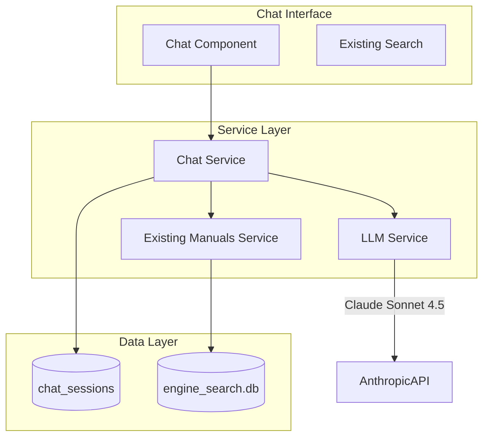

# LLM-Powered Manuals Assistant

**Overview:** Add a conversational troubleshooting assistant to the manuals section, leveraging the existing FTS5 RAG infrastructure. Optimized for quality over cost — on-demand expert use at low volume, not high-throughput cheap queries. The assistant retrieves relevant manual excerpts, cites sources, and streams responses via SSE.

**Model:** Claude Sonnet 4.5 (~$7/mo at 10 queries/day). Best technical reasoning, excellent instruction-following for RAG grounding, familiar SDK.

**Usage profile:** On-demand, ~5-10 queries/day when actively troubleshooting. Cost is negligible at this volume — optimize for best possible answers.

---

## Todos

- [ ] **Phase 0:** Spike — validate Claude Sonnet 4.5 + FTS5 RAG pipeline with real manual queries
- [ ] **Phase 1.1:** Create `llm_service.py` (Anthropic SDK wrapper, sync, Sonnet 4.5)
- [ ] **Phase 1.2:** Create system prompt in `src/prompts/manuals_assistant.py`
- [ ] **Phase 1.3:** Add `get_context_for_llm()` to `manuals_service.py`
- [ ] **Phase 1.4:** Create `chat_service.py` (context assembly, conversation history, token management)
- [ ] **Phase 1.5:** Create chat routes + mobile-first chat UI with SSE streaming
- [ ] **Phase 1.6:** Error handling, tests

---

## Architecture Overview



---

## Phase 0: Spike (1 session)

**Goal:** Validate Claude Sonnet 4.5 with real manual content before building infrastructure.

Build a standalone script that:
1. Takes a query (e.g., "3516 fuel rack actuator troubleshooting")
2. Calls `search_manuals()` to get top 5 FTS5 results
3. Formats results as structured context with citations
4. Sends to Claude Sonnet 4.5 via the Anthropic SDK with the marine engineering system prompt
5. Streams the response

**Validate:**
- Response quality on technical content (torque specs, clearances, diagnostic codes)
- Citation accuracy (does it reference the right manual sections?)
- Handling of multi-step procedures (step-by-step clarity)
- Behavior when RAG context doesn't contain the answer (does it say so or hallucinate?)
- Streaming latency (time to first token)
- Anthropic SDK reliability (streaming, error messages, token counting)

**Kill decision:** If response quality is poor with real manual content, reassess model choice before building infrastructure.

---

## Phase 1: Core Chat + RAG

### 1.1 LLM Service

Create `src/services/llm_service.py`:

- Wrapper around the Anthropic Python SDK (`anthropic`)
- **Synchronous** — Flask is sync, keep it simple
- Claude Sonnet 4.5 (`claude-sonnet-4-5-20250929`)
- Retry with exponential backoff (3 attempts)
- Configurable timeout (30s default)

```python
class LLMService:
    def complete(self, messages: list[dict], context: str) -> str
    def stream(self, messages: list[dict], context: str) -> Iterator[str]
    def count_tokens(self, text: str) -> int
```

One clean wrapper around the Anthropic SDK. If you ever need to swap providers, refactor one file.

### 1.2 System Prompt

Create `src/prompts/manuals_assistant.py`:

This is where the feature quality lives. The prompt must handle:

- **Identity:** Marine engineering assistant for CAT engines (3516, C18, C32, C4.4)
- **Grounding:** Use retrieved manual excerpts as authoritative source. Always cite document name and page number.
- **Honesty:** If the retrieved context doesn't contain the answer, say so explicitly. Never hallucinate specs, clearances, or procedures.
- **Safety:** For safety-critical values (torque specs, valve clearances, pressure limits), quote the manual verbatim and recommend verifying against the physical manual.
- **Clarification:** Ask about specific equipment model, symptoms, and operating conditions before diagnosing.
- **Scope:** Decline questions outside the indexed manual content. Redirect to search.

```python
SYSTEM_PROMPT = """..."""

def format_context(results: list[dict]) -> str:
    """Format RAG results into structured context for the LLM."""
    ...

def build_messages(system: str, context: str, history: list, query: str) -> list:
    """Assemble full message list within token budget."""
    ...
```

### 1.3 RAG Integration

Enhance `src/services/manuals_service.py`:

- Add `get_context_for_llm(query: str, limit: int = 5) -> list[dict]`
- Return structured results with: content, source document, page number, authority level
- Leverage existing `search_manuals()` and `search_cards()`
- Format with clear citation markers for the LLM

### 1.4 Chat Service

Create `src/services/chat_service.py`:

- Context assembly from RAG search results
- Conversation history (in-memory, max 10 turns per session)
- Token budget management (system prompt + RAG context + history fits within model limits)
- Formats the full prompt: system + context + history + user query

### 1.5 Chat Routes + UI

Create `src/routes/chat.py` and `templates/manuals/chat.html`:

**Routes:**
- `GET /manuals/chat` — Chat interface
- `POST /api/chat/message` — Send message, get streamed response (SSE)

**UI:**
- Mobile-first chat interface matching existing design system
- Streaming response display (tokens appear as they arrive)
- Source citations as tappable links to manual sections
- Clear conversation / new chat button

**Streaming:** Use Flask's `Response(stream_with_context(generator))` with `text/event-stream` content type. Sync generator from `LLMService.stream()`.

### 1.6 Error Handling + Tests

**Degradation path:**

| Condition | Behavior |
|-----------|----------|
| API works | Stream LLM response with citations |
| API slow (>30s) | Show "Thinking..." with cancel button, timeout |
| API fails (500) | Show error + FTS5 search results as fallback |
| API rate-limited (429) | Retry once after backoff, then show error |

**Tests:**
- Unit tests for `get_context_for_llm()` — context assembly and formatting
- Unit tests for system prompt building and token budget management
- Integration tests with mocked LLM responses — full pipeline without API calls
- One end-to-end test hitting real API (marked `@pytest.mark.slow`)

---

## Key Files to Create/Modify

**New Files:**

- `src/services/llm_service.py` — LLM wrapper
- `src/services/chat_service.py` — Chat logic + context assembly
- `src/prompts/manuals_assistant.py` — System prompt + formatting
- `src/routes/chat.py` — Chat endpoints
- `templates/manuals/chat.html` — Chat UI

**Modified Files:**

- `src/services/manuals_service.py` — Add `get_context_for_llm()`
- `src/models.py` — Add `ChatSession` model
- `src/app.py` — Register chat blueprint
- `src/config.py` — Add LLM API key + chat settings
- `requirements.txt` — Add `anthropic`

---

## Security Considerations

- Never send PII to LLM APIs
- Sanitize manual content before sending (strip any crew names from context)
- Rate limiting on chat endpoints (existing infrastructure)
- API key stored in environment variable, never in code

---

## Database Migration

New table:

- `chat_sessions` — Conversation history (user_id, messages JSON, created_at, updated_at)

---

## Session Plan

| Session | Deliverable | Output |
|---------|-------------|--------|
| **1** | Spike | Validate Sonnet 4.5 + FTS5 RAG with real queries. Go/no-go. |
| **2** | Services | `llm_service.py`, `chat_service.py`, `get_context_for_llm()`, system prompt |
| **3** | UI + Routes | Chat route, SSE streaming, mobile chat UI |
| **4** | Hardening | Error handling, fallback behavior, tests |

---

## Future Considerations (Post-Ship)

Evaluate after using the assistant on real troubleshooting scenarios:

- Conversation persistence across sessions
- Response caching for repeated questions
- User pattern tracking (search history, preferred docs)
- Guided troubleshooting workflows with step-by-step diagnosis
- Upgrade to Opus if deeper reasoning needed on complex diagnostics
