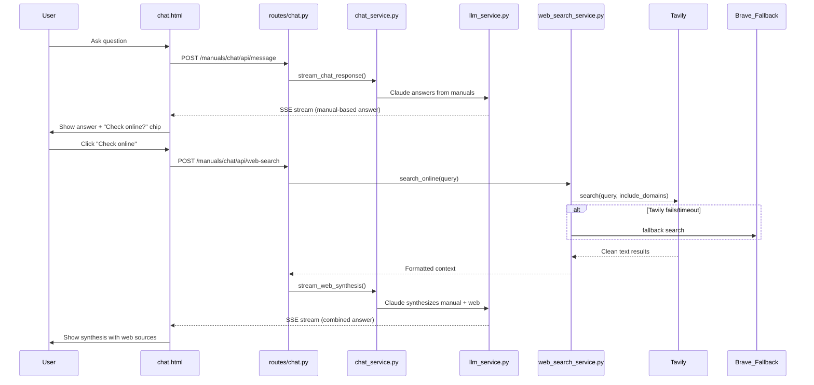

# Phase 3: Parallel Internet Search

## Overview

Add parallel internet search to the chat assistant using Tavily as primary search provider (with Brave fallback), integrating via an opt-in "Check online" flow that feeds web results into Claude for synthesis alongside manual-based answers.

## Architecture



## Key Design Decisions

- **Opt-in, not automatic.** Manual answer streams first. A "Check online for known issues?" chip appears after. Engineer clicks to trigger web search. Keeps the "engineer drives" principle.
- **Tavily primary, Brave fallback.** Tavily returns clean LLM-ready text with native domain filtering. Brave is faster (~670ms) and acts as fallback if Tavily times out or errors.
- **Offline graceful degradation.** Check `navigator.onLine` before showing the chip. If offline, don't show it. If search fails mid-request, show "Web search unavailable — showing manual results only."
- **Cache results in SQLite.** Key by query hash, TTL 24-72 hours. Ship internet is slow — reuse results for repeated/similar queries. Cache serves results instantly when offline for previously-searched topics.
- **Low token budget.** Cap web context at ~2000 tokens to avoid blowing up Claude costs. 3-5 results, basic depth.

## Files to Create

### `src/services/web_search_service.py`
New service with `WebSearchService` class:
- `search_online(query, equipment, domains)` — Tavily primary search
- `_brave_fallback(query)` — Brave backup
- `_cache_get(query_hash)` / `_cache_set(query_hash, results)` — SQLite cache layer
- `create_web_search_service(app)` / `get_web_search_service()` — Factory + singleton (matches `llm_service.py` pattern)
- Graceful degradation: returns `None` if no API keys configured
- Default `include_domains`: caterpillar.com, cat.com, thedieselpage.com, marineinsight.com, barringtondieselclub.co.za, marinediesels.info

### `tests/test_web_search_service.py`
Unit tests:
- Tavily search with mocked API responses
- Brave fallback when Tavily fails
- Cache hit/miss behavior
- Graceful degradation when no API keys
- Domain filtering
- Timeout handling

### `tests/test_web_search_route.py`
Route integration tests:
- POST `/manuals/chat/api/web-search` with valid/invalid input
- Rate limiting on the endpoint
- Auth required
- Offline/unavailable service returns appropriate error

## Files to Modify

### `src/config.py`
Add env vars:
- `TAVILY_API_KEY`, `BRAVE_SEARCH_API_KEY` (both optional)
- `WEB_SEARCH_TIMEOUT` (default 10s), `WEB_SEARCH_CACHE_TTL` (default 86400s / 24hr)
- `WEB_SEARCH_MAX_RESULTS` (default 5)

### `src/app.py`
Initialize `web_search_service` in app factory (after LLM service init)

### `src/routes/chat.py`
Add new endpoint:
- `POST /manuals/chat/api/web-search` — Accepts `{query, session_id, equipment}`, runs web search, feeds results + conversation history into Claude for synthesis, streams SSE response
- Rate limit: `RATE_LIMIT_AUTH_PER_MINUTE` (5/min) — same as `send_message` since it calls both Tavily and Claude

### `src/services/chat_service.py`
Add:
- `stream_web_synthesis(query, web_results, history, equipment)` — Builds prompt combining manual context + web results, streams Claude's synthesis
- New prompt section for web synthesis (instruct Claude to compare manual procedure vs field reports, flag discrepancies, cite web sources)

### `src/prompts/manuals_assistant.py`
Add web synthesis system prompt template (separate from triage/deep-dive prompts)

### `templates/manuals/chat.html`
Frontend changes:
- After every manual-based response, inject a "Check online for known issues?" chip (only if `navigator.onLine` and web search service is configured)
- Click handler: POST to `/manuals/chat/api/web-search`, stream response into a new "Web Results" bubble with distinct styling (different background/border to distinguish from manual answers)
- Loading state: "Searching the web..." spinner
- Error state: "Web search unavailable" inline message (no modal, no disruption)

### `.env.example`
Document new optional env vars

### `src/security.py`
Add `RATE_LIMIT_SEARCH_PER_MINUTE = "10/minute"` (optional, if we want a separate limit for web search)

## Ship Internet Optimizations

- **Cache aggressively.** SQLite table `web_search_cache` with columns: `query_hash`, `results_json`, `created_at`. TTL configurable (default 24h).
- **Short timeouts.** Tavily timeout 10s, Brave fallback 8s. Total budget 15s before giving up.
- **Basic depth only.** Never use Tavily `advanced` — doubles credits AND latency. Basic is sufficient for snippets.
- **`max_results=5`.** More results = more bytes over slow satellite. 5 is enough for Claude to synthesize.
- **Prefix queries with context.** Automatically prepend equipment type: "Caterpillar 3516 {query}" for better relevance.

## Tavily API Reference (for implementation)

```python
from tavily import TavilyClient

client = TavilyClient(api_key="tvly-YOUR_KEY")

response = client.search(
    query="Caterpillar 3516 valve lash procedure known issues",
    search_depth="basic",           # 1 credit (vs "advanced" = 2 credits)
    max_results=5,                  # Keep low for bandwidth
    include_domains=[               # Native domain filtering
        "caterpillar.com", "cat.com",
        "thedieselpage.com", "marineinsight.com",
        "barringtondieselclub.co.za", "marinediesels.info",
    ],
    include_raw_content=False,      # Keep fast
    timeout=10,                     # Ship internet timeout
)

# Response format:
# response["results"] = [
#     {"title": str, "url": str, "content": str, "score": float},
#     ...
# ]
# response["query"], response["response_time"]
```

Brave fallback:
```python
import requests

headers = {"X-Subscription-Token": "YOUR_BRAVE_KEY", "Accept": "application/json"}
params = {"q": f"Caterpillar marine diesel {query}", "count": 5}
resp = requests.get(
    "https://api.search.brave.com/res/v1/web/search",
    headers=headers, params=params, timeout=8
)
# resp.json()["web"]["results"] = [{"title", "url", "description"}, ...]
```

## Scope Boundaries (NOT in this phase)

- No pre-fetching/warming cache (Phase 3.5)
- No Tavily `/extract` for full-page content (Phase 3.5)
- No multi-model "council" approach (Phase 6)
- No parts lookup integration (Phase 4)

## Dependencies

- `tavily-python` (pip install tavily-python) — v0.7.21+
- `requests` (already in project) — for Brave fallback

## Reference

- API comparison research: `docs/search-api-compare.md`
- Phase 1+2 architecture: `.cursor/plans/search-integrated_chat_assistant_e7bdb770.plan.md`
- Existing chat service: `src/services/chat_service.py`
- Existing LLM service: `src/services/llm_service.py`
- Existing prompts: `src/prompts/manuals_assistant.py`
