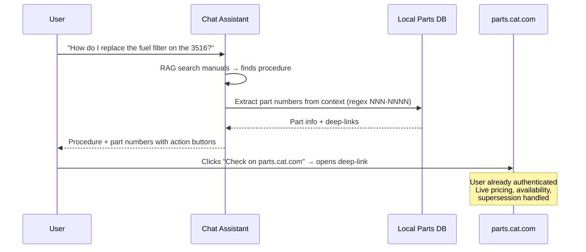

# Phase 4: CAT Parts & Deep-Link Integration

## Overview

Add part number extraction, local parts database, and one-click deep-links to parts.cat.com so the LLM chat assistant can identify parts during troubleshooting and help the engineer check availability instantly.

**No API exists** for SIS2 or parts.cat.com. This phase uses a practical hybrid approach: extract part numbers from indexed manuals, build a local lookup DB, and deep-link to CAT's official platforms where the user is already authenticated.

## Architecture



## Key Design Decisions

- **No scraping, no reverse engineering.** CAT's EULA explicitly prohibits automated access to SIS2. Losing SIS access would be operationally devastating. We deep-link instead.
- **Local parts DB from indexed manuals.** Regex extraction of NNN-NNNN part numbers, enriched with LLM-classified categories and engine applicability.
- **parts.cat.com handles supersession.** When you search an old part number, it redirects to the current one. No need to track supersessions locally.
- **CSV export for bulk orders.** Compatible with parts.cat.com Quick Order (up to 180 parts per upload).
- **Engineer drives.** Part lookup links are suggestions, not automatic actions.

## CAT Part Number Format

Modern 3516, C18, C32 engines use exclusively `NNN-NNNN` format:

```python
CAT_PART_PATTERN = re.compile(r'\b(\d{3}-\d{4})\b')
```

Examples: `230-5743`, `1R-0751`, `420-0751`

## Deep-Link Format

```
https://parts.cat.com/en/catcorp/search?searchTerm={part_number}
```

Opens the parts.cat.com search results for that part number. User must be authenticated to see pricing/availability (they already have a login).

## Files to Create

### `src/services/parts_service.py`

Part number extraction and local database service:

- `PartsService` class
- `extract_parts_from_text(text: str) -> list[str]` — Regex extraction of NNN-NNNN part numbers
- `lookup_part(part_number: str) -> dict | None` — Query local parts DB
- `search_parts(query: str, engine: str | None) -> list[dict]` — Full-text search of parts DB
- `generate_parts_link(part_number: str) -> str` — Deep-link to parts.cat.com
- `generate_sis2_link() -> str` — Link to sis2.cat.com
- `generate_parts_csv(parts: list[dict]) -> str` — CSV compatible with parts.cat.com Quick Order
- `create_parts_service(app)` / `get_parts_service()` — Factory + singleton pattern

### `src/scripts/extract_parts.py`

One-time extraction script:

- Scan all indexed manual pages in the manuals SQLite DB
- Extract part numbers via regex
- Use LLM to classify each part from surrounding context (filter, gasket, seal, sensor, bearing, etc.)
- Build `data/parts.db` with schema:
  ```sql
  CREATE TABLE parts (
      part_number TEXT PRIMARY KEY,
      description TEXT,
      category TEXT,
      engine_models TEXT,  -- JSON array: ["3516", "C18"]
      source_docs TEXT,    -- JSON array of {doc, page} refs
      context TEXT,        -- surrounding text snippet
      extracted_at TEXT    -- ISO timestamp
  );
  CREATE INDEX idx_parts_category ON parts(category);
  CREATE INDEX idx_parts_engine ON parts(engine_models);
  ```

### `tests/test_parts_service.py`

- Part number regex extraction (valid/invalid patterns, edge cases)
- Local DB lookup (found/not found)
- Deep-link generation
- CSV export format validation
- Parts search

### `tests/test_extract_parts.py`

- Extraction from sample manual text
- LLM classification mocking
- DB schema validation

## Files to Modify

### `src/services/chat_service.py`

- After RAG context is built, extract part numbers from the context text
- Include part lookup results (description, category, deep-links) in the LLM prompt
- Instruct the LLM to present part numbers with action links when relevant

### `src/prompts/manuals_assistant.py`

Add parts-aware prompt section:
```
When part numbers (format: NNN-NNNN) appear in the manual context:
- List them clearly with their description and category
- Note which engine(s) they apply to
- Include the parts.cat.com link for each
- If multiple parts are needed for a procedure, offer to generate a parts list CSV
- Always note: "Verify current pricing and availability on parts.cat.com"
```

### `templates/manuals/chat.html`

- Detect part number links in LLM responses (`parts.cat.com/...`)
- Render as styled action buttons: "Check on parts.cat.com" with external link icon
- Add "Download Parts CSV" button when multiple parts are identified
- Add "Open SIS2" secondary action link

### `src/app.py`

- Initialize `parts_service` in app factory

### `src/config.py`

- `PARTS_DB_PATH` — path to parts SQLite DB (default: `data/parts.db`)

## Agent Breakdown (for multi-agent execution)

### Agent 1: Parts Extraction + Database (branch: `agent/1-parts-extraction`)
- Create `src/scripts/extract_parts.py`
- Create `src/services/parts_service.py` (extraction, lookup, deep-links, CSV)
- Add config, app.py wiring
- Create `tests/test_parts_service.py` and `tests/test_extract_parts.py`
- Run extraction script to populate `data/parts.db`

### Agent 2: Chat Integration (branch: `agent/2-parts-chat-integration`)
- Modify `chat_service.py` to extract and enrich part numbers in responses
- Update `manuals_assistant.py` with parts-aware prompt
- Add route for CSV download if needed
- Tests for parts integration in chat flow

### Agent 3: Frontend UX (branch: `agent/3-parts-frontend`)
- Render part number action buttons in chat bubbles
- "Check on parts.cat.com" deep-link buttons
- "Download Parts CSV" button
- "Open SIS2" secondary link
- Style action buttons distinctly from suggestion chips

## Merge Order

1. Agent 1 first (extraction + service — no dependencies)
2. Agent 2 second (chat integration — depends on Agent 1's service)
3. Agent 3 last (frontend — depends on Agent 2's response format)

## Scope Boundaries (NOT in this phase)

- No SIS2 scraping or automated access (legal risk)
- No Cat IP (B2B/EDI) integration (requires dealer onboarding)
- No real-time pricing in-app (always link to parts.cat.com)
- No parts ordering from within the app
- No aftermarket supplier integration

## Future Enhancements (Phase 4.5+)

- Contact CAT dealer about Cat IP eligibility
- Register on digital.cat.com for emerging APIs
- Shopping list builder across multi-turn troubleshooting sessions
- Filter cross-reference integration (catfiltercrossreference.com)
- Part number trending/analytics (most frequently referenced parts)

## Dependencies

- No new Python packages required (regex, sqlite3, csv are stdlib)
- LLM calls for part classification during extraction (uses existing Anthropic service)

## Reference

- API research: `docs/cat-parts-integration-research.md`
- Phase 3 (web search): `docs/phase-3-web-search-plan.md`
- Existing chat service: `src/services/chat_service.py`
- Existing manuals DB: `data/manuals.db`
